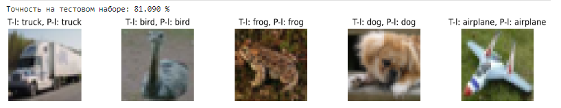

# Классификатор изображений на основе набора данных CIFAR-10

Этот проект представляет собой пример простого классификатора изображений, построенного с использованием библиотеки PyTorch. Модель обучена на наборе данных CIFAR-10 и способна классифицировать изображения в одну из десяти категорий.

## Требования

- Python 3
- PyTorch
- Matplotlib
- Numpy

## Результат



## [Code there 🏆: > `81 %`](./jupiter.ipynb)

## Установка зависимостей

```bash
pip install -r requirements.txt
